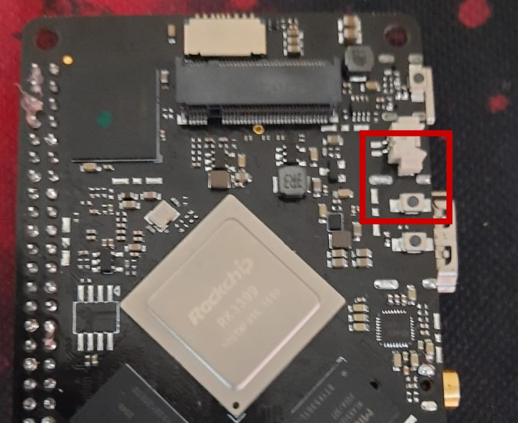

# **Guide for Flashing to eMMC on Linux Host**

## **1. Requirements**

1. BrainyPi v1.0
1. Compiled Linux image `system.img`
1. Linux Laptop/PC
1. USB 5V 3A Power Supply 

   
   
1. USB Type C cable 
2. 
   

1. USB Male A to Male A cable

   

1. USB to TTL Serial Cable **_(Optional)_**
 
   

## **2. Installing Tools and Drivers**

1. Download the tools for flashing.
   1. Tool for flashing - `rkdeveloptool-v1.32.zip` - [Download Link](https://github.com/brainypi/brainypi-android-manifests/raw/master/flashing_tools/rkdeveloptool-v1.32.zip) 
   2. BrainyPi loader - `rk3399_loader_v1.20.119.bin` - [Download Link](https://github.com/brainypi/brainypi-android-manifests/raw/master/flashing_tools/rk3399_loader_v1.20.119.bin)    
2. Extract the file rkdeveloptool-v1.32.zip
3. Navigate to folder rkdeveloptool and Open a new Terminal in the folder. 
4. Run these commands given below to compile and Install rkdeveloptool 
   ```sh
   # Install pre-reqsites
   sudo apt-get install libudev-dev libusb-1.0-0-dev dh-autoreconf pkg-config libusb-1.0
   # Compile 
   autoreconf -i
   ./configure
   make 

   # Install rkdeveloptool
   sudo cp rkdeveloptool /usr/local/bin
   sudo ldconfig
   ```

5. Check if the tool was installed successfully. 
   ```sh
   sudo rkdeveloptool -v 
   ```
   Output should be `rkdeveloptool ver 1.32`


## **3. Boot into MaskRom mode**

1. Power off the board.
2. Remove microSD card (if inserted before). 
3. Connect **USB Male A to Male A cable** to Board’s Top USB 3.0 slot and to Laptop/PC.

   

4. Press and hold the Maskrom key on the backside of the Board. 

   


5. Power on the board. 
6. Release the Maskrom key. (Important to release the key)
7. Confirm that your board is in Maskrom mode by running the `lsusb` command

   


    You should see “RK3399 in Mask ROM mode” message in the output


## **4. Flash into eMMC**

1. On your Laptop/PC, Open new Terminal
2. Run the command `sudo rkdeveloptool ld` it should show the board connected
   


3. Flash the BrainyPi loader into eMMC by running the command
   ```
   sudo rkdeveloptool db /path/to/rk3399_loader_v1.20.119.bin
   ```


4. Flash the GPT image to eMMC, by running the command 
   ```sh
   sudo rkdeveloptool wl 0 /path/to/system.img
   ```

5. Reboot the device by running the command 
   ```sh
   sudo rkdeveloptool rd
   ```

6. Now the device should boot the new image on eMMC. 
